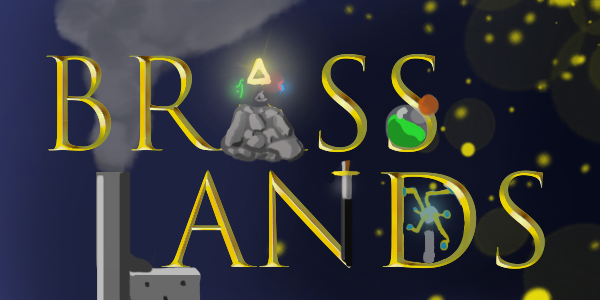

BrassLands is an open-source Python based steampunk, fantasy, rouge-like created by the UCD NetSoc. It is built using [libtcod](https://bitbucket.org/libtcod/libtcod) and [pygame](https://www.pygame.org/), and is currently in the very earliest stages of development!  
We would love any help that we can get, but remember to leave the *easy* stuff for people who haven't programmed that much before.

## Want to help out?

You need to have python installed and a few libraries before you can run the project. Here's what we are using so far:

 - python 3.6+
 - libtcod - library for creating rouge-likes. We are using the python port - [python-tcod](https://python-tcod.readthedocs.io/en/latest/readme.html)
 - pygame - library for creating games using python.
  
  
### Windows and Mac
Get the latest python 3 version [here](https://www.python.org/downloads/).  
 To install the necessary libraries, run the following commands in the terminal.
 > \> python -m pip install -r requironments.txt

### Linux

If you don't have python 3 already, you can download it through your favourite package manager. For example un Ubuntu/Debian based systems, you can use:  
> $ sudo apt-get python3

I'm fairly certain you should be able to get the other packages you need simply by using the commands:  
> $ pip install -r requironments.txt

## What needs to be done?
We're happy to take on any help and the current work that is needed is listed in the issues tab. You can also add your own issues if you think something is missing or want help with adding a feature or fixing a bug. The current plan is to get a working MVP  with the following scope and then see how we expand form there.
## Project Scope
Here's how I imagine the game playing out as a simple MVP:  

#### Levels
 - About 10 "levels", static or randomly generated, with a simple story (bandit caves or something)
 - A simple grid system.
 
#### Character
 - Arrow keys to move 
 - basic rouge-like fight system, (move into an enemy to attack)  
 - A simple equipment system
 - At least two sets of different equipment
 - Some other items (consumables?)
 - (Possibly a ranged/magic attack system)
 
#### Enemies
 - A few different types of enemies.
 - Enemies come pre defined wearing simple equipment that is dropped upon death.
 - Two distinct types of simple AI/behaviours for enemies.
 
 
 Enemies and items should preferably be read in as JSON so that it is easy to add, remove and modify specific items and enemies.
 

As we are probably going to be a mostly programmer based team, I'm choosing to focus here on what is needed programmatically. If anyone wants to contribute with sprites, music, ideas or world-building, feel free to open an issue or ask around for what needs to be done. 

